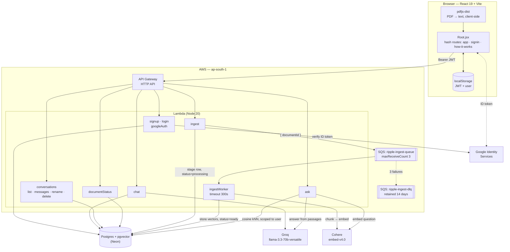
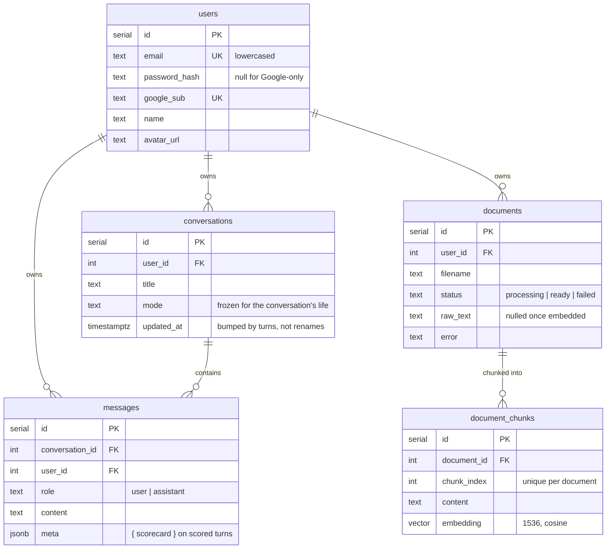

# Ripple

**A skills platform that happens to use chat as its interface.**

Most "AI chat with modes" products change the system prompt and call it a feature. Ripple's
premise is different: a **mode is a workflow with a rubric**, not a prompt persona. Two of the
four modes score you against fixed criteria on every turn, persist that score onto the message,
and let the session compute whether you are actually getting better.

That is the part a generic chat UI cannot copy: **a scored, improving session.**

---

## The four modes

One mode per conversation, enforced server-side from `conversations.mode`. Switching modes
starts a new chat rather than changing the rules mid-thread.

| Mode | What it does | Scored on |
|---|---|---|
| **General** | Direct assistant, no ceremony | — |
| **Coach** | Mock interview. Asks, scores your answer, then raises the bar — harder if you did well, the same ground again if you did not | structure · specifics · impact · ownership |
| **Resume Review** | Reads a pasted or attached resume the way a hiring manager does, quotes the weak bullets and rewrites them | impact · relevance · clarity · credibility |
| **Document Q&A** | Answers strictly from passages retrieved out of an uploaded PDF/txt, with inline `[1] [2]` citations | — |

All scores are 0–100. The scale is anchored in the prompt (`90–100` exceptional, `40–59` weak, …)
because an unanchored 0–100 drifts until everything is an 85.

---

## The mechanism

Evaluative modes do **not** reply in prose. They reply in a fixed JSON envelope, and the backend
composes the visible markdown itself:

```
                    ┌─────────────────────────────────────┐
   user message ───►│ system = workflow.system            │
                    │        + envelopeInstructions(...)  │──► Groq, response_format: json_object
                    └─────────────────────────────────────┘
                                     │
                    { scored, verdict, criteria{}, strengths[], improvements[], next }
                                     │
                    ┌────────────────┴────────────────┐
                    ▼                                 ▼
          normaliseScorecard()                  composeReply()
          clamp 0–100, drop unknown             the markdown the user reads,
          keys, require ≥2 criteria             assembled from the fields
                    │                                 │
                    └────────────────┬────────────────┘
                                     ▼
                        messages.meta = { scorecard }
```

Two consequences fall out of this:

1. **The shape of a turn is deterministic** even though the words are not. Every scored reply has
   a verdict, a strengths list, a fixes list, and one next action — in that order, every time.
2. **The session trend is a pure function of the thread.** Nothing is cached or counted. Reopen a
   conversation six weeks later and the whole improvement curve rebuilds itself from
   `messages.meta`. A failed turn contributes nothing rather than leaving a hole in a counter.

The model is trusted for words and nothing else — `normaliseScorecard` clamps every score, drops
keys it did not ask for, and returns `null` if fewer than two criteria came back, because a card
built from one criterion would misreport the session average. If the JSON never arrives, the turn
falls back to a plain-prose re-ask: losing the score beats losing the turn.

---

## Architecture



### Why ingestion is queued

A 40-page PDF is minutes of chunking and embedding. API Gateway caps a request at 29 seconds, so
`POST /api/ingest` only *stages* the text and returns `202 { status: 'processing' }`; the worker
gets 300 seconds and its own retry budget. The client polls `GET /api/documents/:id` until the row
flips to `ready`, because asking before the chunks exist retrieves nothing.

The worker is idempotent against SQS's at-least-once delivery: it no-ops on a document already
`ready`, and otherwise deletes the document's chunks before re-inserting them. Three failures send
the job to the DLQ and the row to `failed` with the error message the user actually sees.

### Two upload paths, deliberately different

| | Document Q&A | Resume Review |
|---|---|---|
| Where the text goes | Uploaded, chunked, embedded, stored | Read in the browser, folded into the next message |
| Why | The mode *retrieves* from it | The mode *scores what you send it* |
| Result | Answers cite passages | The resume lives in the thread like anything else you typed — reload, history and export all work with no special case |

---

## Tech

**Frontend** — React 19, Vite 8, `react-markdown` + `remark-gfm`, `pdfjs-dist`. No state library,
no UI kit, no CSS framework: ~4,600 lines of hand-written CSS against a token file.

Notably **no router library**. Routing is hash-based and hand-rolled ([`Root.jsx`](web/src/Root.jsx),
[`App.jsx:41-60`](web/src/App.jsx#L41-L60)) because the hero and the chat are one continuous
scroll-driven stage — a real router would unmount the very thing the transition animates.

**Backend** — Serverless Framework v4, AWS Lambda on Node 20 behind an HTTP API, SQS with a DLQ,
Postgres + pgvector on Neon. Groq (`llama-3.3-70b-versatile`) for generation, Cohere (`embed-v4.0`)
for embeddings. Auth is bcrypt + a self-signed JWT (24h), with Google Sign-In converging on the
same token — verify the credential once, then every request after that is identical.

---

## Repo layout

```
backend/
  handlers/        one file per Lambda; each begins with requireAuth
  lib/
    rubrics.js     the mode workflows, the JSON contract, score normalisation
    llm.js         Groq calls + the scored-turn fallback chain
    retrieval.js   pgvector kNN, mandatorily scoped to a user
    chunk.js       ~1000-char overlapping chunks, snapped to sentence breaks
    auth.js        bcrypt, JWT, and the requireAuth guard
  schema.sql       full schema, idempotent — run this on a fresh database
  serverless.yml   functions, SQS queue + DLQ, IAM

web/src/
  Root.jsx         the three surfaces and who is allowed on them
  App.jsx          the chat stage: scroll transition, modes, uploads, sending
  lib/modes.js     the frontend half of rubrics.js — everything a mode changes about the UI
  lib/scoring.js   session trend, derived from messages, never stored
  lib/session.js   token storage and the pending-message stash
  styles/          tokens.css is the source of truth; see DESIGN.md

DESIGN.md          the design system, derived from the shipped artifact
PRODUCT.md         what this is and who it is for
API_CONTRACT.md    endpoint shapes
```

---

## Getting started

### Prerequisites

- Node 20+
- A Postgres database with the `vector` extension available (Neon works out of the box)
- API keys: [Groq](https://console.groq.com), [Cohere](https://dashboard.cohere.com)
- Optional: a Google Cloud OAuth "Web application" client ID

### 1. Database

```bash
psql "$DATABASE_URL" -f backend/schema.sql
```

Every statement is `IF NOT EXISTS`, so re-running it is safe. It is **not** a migration, though —
`IF NOT EXISTS` skips a table that already exists rather than reconciling it, so a column added to
`schema.sql` will not appear on an older database. Those go in `backend/migrations/` as an `ALTER`
as well (see `001_message_meta.sql`).

> **Before creating a fresh database**, confirm the embedding width. `schema.sql` declares
> `VECTOR(1536)`, which is `embed-v4.0` at its default output dimension — deploy the backend and
> hit `GET /api/embedtest`, which exists to report that number from a live call. A mismatch fails
> at insert time, not at create time.

### 2. Backend

```bash
cd backend
npm install
```

Create `backend/.env`:

```ini
DATABASE_URL=postgres://...      # Neon connection string
GROQ_API_KEY=gsk_...
COHERE_API_KEY=...
JWT_SECRET=                      # any long random string
GOOGLE_CLIENT_ID=...apps.googleusercontent.com
```

Then:

```bash
npm run offline     # serverless-offline on :3000
npm run deploy      # serverless deploy to ap-south-1
npm run logs -- chat
```

> `INGEST_QUEUE_URL` is resolved from the CloudFormation stack, so document ingestion needs a real
> deploy — under `serverless offline` the other modes work but uploads have nowhere to queue.

### 3. Frontend

```bash
cd web
npm install
npm run dev         # :5173, proxying /api to :3000
```

`web/.env.local`:

```ini
VITE_API_BASE=              # empty in dev; the deployed httpApi URL in prod
VITE_GOOGLE_CLIENT_ID=      # must match the backend's GOOGLE_CLIENT_ID
```

Leaving `VITE_GOOGLE_CLIENT_ID` unset drops the Google button and its divider; email/password
sign-in is unaffected.

```bash
npm run build       # → web/dist
npm run lint
```

---

## API

Everything under `/api` except `/api/auth/*` and `/api/health` requires `Authorization: Bearer <jwt>`.
Ownership violations return **404, not 403** — a 403 confirms the resource exists.

| Method | Path | Notes |
|---|---|---|
| `POST` | `/api/auth/signup` | → `{ token, user }`. `409` on a duplicate email |
| `POST` | `/api/auth/login` | → `{ token, user }`. One vague `401` for every failure mode |
| `POST` | `/api/auth/google` | Body `{ credential }` — the Google ID token. Matches on `sub` first, then links onto an existing password account by email — but only if Google reports `email_verified`, which is what makes the linking safe from hijacking |
| `POST` | `/api/chat` | Body `{ conversationId?, mode, message }` → `{ conversationId, messageId, mode, reply, scorecard }` |
| `GET` | `/api/conversations` | → `{ conversations: [{ id, title, mode, created_at, updated_at }] }` |
| `GET` | `/api/conversations/:id/messages` | → `{ conversationId, messages: [{ id, role, content, meta, created_at }] }` |
| `PATCH` | `/api/conversations/:id` | Body `{ title }`. Deliberately does not touch `updated_at` |
| `DELETE` | `/api/conversations/:id` | Messages cascade |
| `POST` | `/api/ingest` | Body `{ text, filename }` → `202 { documentId, status: 'processing' }` |
| `GET` | `/api/documents/:id` | → `{ documentId, filename, status, error }`. Poll until `ready` |
| `POST` | `/api/ask` | Body `{ question, documentId }` → `{ answer, sourcesUsed }` |
| `GET` | `/api/health` · `/api/llmtest` · `/api/embedtest` | Diagnostics, unauthenticated |
| `GET` | `/api/dbtest` | ⚠️ Unauthenticated and leaks every user's conversations — see [Known gaps](#known-gaps) |

**`mode` on `POST /api/chat`** only takes effect when creating a conversation. On an existing one
the stored `conversations.mode` wins and is echoed back, so a stale tab cannot score a coach turn
against the resume rubric.

**`scorecard`** is `null` unless the mode runs a rubric *and* the model judged the message
scoreable — a setup message or a follow-up question is answered without a score. When present:

```json
{
  "max": 100,
  "overall": 72,
  "verdict": "one-line summary",
  "criteria": [{ "key": "impact", "label": "Impact", "score": 68, "note": "…" }]
}
```

**`sourcesUsed`** is the top 4 retrieved passages as
`{ marker, documentId, chunkIndex, distance, relevance, excerpt }`, where `relevance` is
`1 − cosine distance` and `marker` maps onto the `[1] [2]` citations in the answer. All 10 go into
the model's context; the tail of a similarity search is usually noise it never leaned on.

Full detail in [API_CONTRACT.md](API_CONTRACT.md).

---

## Data model



`document_chunks` has no owner column of its own — [`retrieval.js`](backend/lib/retrieval.js) joins
through `documents` and filters there. `retrieveChunks` **throws** if called without a `userId`
rather than defaulting to unscoped, so a bug upstream cannot silently reintroduce a cross-user
leak. `messages.user_id` is denormalised from the parent conversation for the same reason: a
handler that loses the conversation predicate still cannot cross tenants.

---

## Design

Documented in full in [DESIGN.md](DESIGN.md). The north star is **"The Instrument Panel"** —
Ripple should look like measuring equipment that happens to talk, because the product's claim is
that you will be scored and the number will move.

- Near-black canvas `#0a0a0b`, lit by exactly one accent: ice-cyan `#5cc8e8`. Amber and red appear
  only as score bands inside a scorecard, where the product's own data is speaking.
- Two type voices: Inter for anything a person says, JetBrains Mono with tabular numerals for
  addresses, labels and measurements.
- Two namespaces sharing one token file — `.h2c-` for the app (tonal cards, real shadows) and
  `.rl-` for the "How it works" page (hairline rules, dotted fields, almost no cards). Same brand,
  deliberately not the same layout language.

> **The token names lie.** The `--emerald-*` family is ice-cyan and always has been; the names are
> a locked port artifact. Resolve the value, never the label.

---

## Known gaps

- **`GET /api/dbtest` should be deleted.** It predates auth and never got the `requireAuth` guard
  every other handler begins with. It runs `SELECT * FROM conversations` with no `user_id`
  predicate and returns the lot — every user's chat titles and modes, to anyone who requests the
  URL. It also inserts a junk conversation with no owner, which now violates the `NOT NULL` on
  `conversations.user_id`, so the endpoint is already broken *and* leaking on the way to failing.
  The insert runs first, so today the handler `500`s before the unscoped read is ever reached —
  the leak is latent, not live. It goes live the moment anyone "fixes" the insert or drops it.
  Remove the handler and its `serverless.yml` entry rather than repairing it.
- **No tests.** The root `package.json` still carries the npm default. The load-bearing pure
  functions — `normaliseScorecard`, `toScale`, `chunkText`, `composeReply` — are the obvious first
  target and need no infrastructure to cover.
- **JWT in `localStorage`.** A deliberate call, with the cost stated in
  [`session.js`](web/src/lib/session.js#L1-L13): the API is a different origin from the static
  site, so a cookie would need `SameSite=None; Secure` plus its own CSRF handling. Anything that
  can run script on the page can read the token. Worth revisiting if the API moves behind the same
  domain.
- **No refresh-token rotation.** Single 24h token; you are signed out when it expires.
- **`@google/genai` is an unused backend dependency** — generation goes through Groq. Safe to drop.
- `web/README.md` is still the Vite template, and `web/fit.mjs` is a throwaway measuring script
  marked for deletion.
